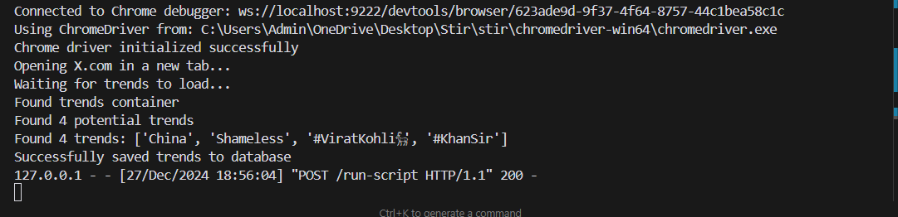
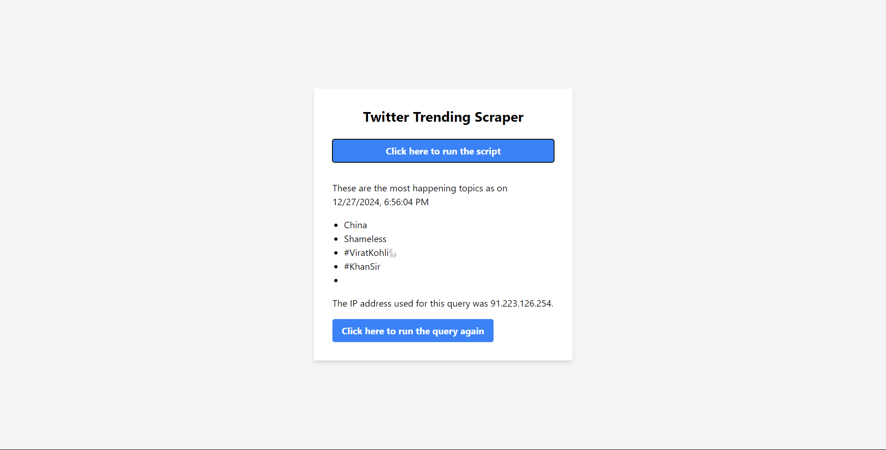

Output:

--> Console Output


--> Website Output 

<video controls src="Twitter Trending Scraper - Brave 2024-12-27 18-58-47.mp4" title="Title"></video>

# Twitter Trends Tracker

A web application that scrapes Twitter trending topics using Selenium and ProxyMesh, stores the data in MongoDB, and displays it on a beautiful web interface built with Tailwind CSS.

## Prerequisites

- Python 3.7+
- MongoDB installed and running locally
- Chrome browser installed
- ProxyMesh account
- Twitter account

## Setup

1. Clone the repository
2. Install dependencies:
   ```bash
   pip install -r requirements.txt
   ```

3. Configure environment variables:
   - Copy `.env.example` to `.env`
   - Fill in your credentials:
     - `MONGO_URI`: MongoDB connection string

4. Make sure MongoDB is running locally

## Running the Application

1. Start the Flask server:
   ```bash
   python app.py
   ```

2. Open your browser and navigate to:
   ```
   http://localhost:5000
   ```

3. Click the "Fetch Latest Trends" button to scrape Twitter trends

## Features

- Automated Twitter login and trend scraping using Selenium
- Proxy rotation using ProxyMesh
- MongoDB storage with unique IDs for each scrape
- Modern UI with Tailwind CSS
- Real-time trend fetching and display
- JSON data view of MongoDB records

## Notes

- The application uses headless Chrome for scraping
- Each request uses a different IP address through ProxyMesh
- Trends are stored with timestamps and IP addresses used
- The UI updates automatically after each scrape 